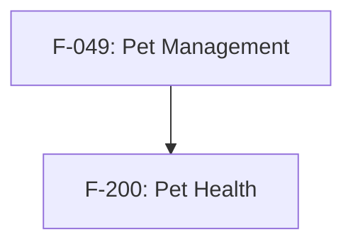

# SPECLAN Implement Command

Implement approved SPECLAN Features using the feature-dev command, then verify all requirements.

## CRITICAL BEHAVIOR RULES

1. **MUST USE /feature-dev:feature-dev** - For EACH feature, invoke the Command /feature-dev:feature-dev IMPORTANT: Do NOT implement features directly without invoking this command.

2. **MUST VERIFY REQUIREMENTS** - After feature-dev completes, verify ALL linked requirements in PARALLEL using Task tool with requirement-verifier agents.

3. **MUST VERIFY FEATURE** - After requirements pass, verify overall feature implementation using feature-verifier agent (5-layer deep verification).

4. **FIX UNTIL ALL PASS** - If any verification fails (requirement OR feature), invoke feature-dev again with fix instructions. Repeat verify-fix cycle until ALL pass. NO LIMIT on retries.

5. **DO NOT STOP between features** - Implement ALL approved features in sequence without pausing. Only stop when ALL features are complete or user intervenes.

6. **Status updates are DEFERRED** - Features go to "under-test" only after ALL features complete. Requirements go to "in-development" during verification.

## Prerequisites

This command requires:
- **feature-dev command** - Must be installed

Check if feature-dev is available. If not installed, show error and stop.

## Instructions

### 1. Find Approved Features

Query SPECLAN directory for features with `status: approved`:

```bash
grep -r "^status: approved" speclan/features/ -l
```

If no approved features found, report and exit.

### 2. Determine Implementation Order (USE AGENT)

**MUST use the implementation-order agent** to analyze dependencies and determine optimal order.

**Pass the exact list of approved features found in Step 1:**

```
Task tool:
  subagent_type: "general-purpose"
  prompt: "You are the implementation-order agent.

  Features to order:
  - F-049-{slug}
  - F-200-{slug}
  - F-301-{slug}
  [list ALL approved feature IDs from Step 1]

  SPECLAN directory: speclan/

  IMPORTANT: Only analyze the features listed above. Do not discover other features.

  For each feature in the list:
  1. Read its spec file and extract depends-on, parent, goals from YAML
  2. Check requirement dependencies between features
  3. Analyze codebase for implicit dependencies
  4. Build Feature Dependency Graph (DAG)
  5. Detect circular dependencies
  6. Perform topological sort (Kahn's algorithm)

  Return ordered list with:
  - Implementation sequence (first to implement at top)
  - Dependency graph visualization
  - Reasoning for each position
  - Parallel implementation opportunities"
```

Wait for agent to return the sorted feature list.

Display the plan:
```
## Implementation Plan

### Dependency Graph
[from agent output]

| Order | Feature | Title | Dependencies | Requirements |
|-------|---------|-------|--------------|--------------|
| 1 | F-XXX | Feature Title | None (root) | R-0001, R-0002 |
| 2 | F-YYY | Another Feature | F-XXX | R-0003 |

Will invoke /feature-dev:feature-dev for EACH feature in this order, then verify requirements.
```

### 3. Execute Implementation Loop

Initialize tracking:
- `completed_features = []`
- `failed_features = []`

**FOR EACH feature in order:**

#### Step A: Update feature status to in-development
```yaml
status: in-development
```

#### Step B: Gather feature context
Read and collect:
- The feature specification file
- All linked requirements
- Acceptance scenarios
- Business rules

#### Step C: INVOKE FEATURE-DEV (MANDATORY)

**YOU MUST use the command /feature-dev:feature-dev**

```
Use Command:
  command: /feature-dev:feature-dev
  args: "Implement feature [F-XXX] [Title]

## Feature Specification
[paste full feature content]

## Requirements
[paste all linked requirements]

## Acceptance Criteria
[paste scenarios and acceptance criteria]
"
```

Wait for feature-dev to complete.

#### Step D: VERIFY REQUIREMENTS (PARALLEL)

**After feature-dev completes, verify ALL linked requirements:**

1. **Find all requirements for this feature:**
   - Check feature's `requirements:` YAML field
   - OR grep: `grep -r "^feature: F-XXX" speclan/`

2. **Set ALL requirements to in-development:**
   Edit each requirement's YAML:
   ```yaml
   status: in-development
   ```

3. **Launch verification agents IN PARALLEL:**
   For EACH requirement, use Task tool:
   ```
   Task tool:
     subagent_type: "general-purpose"
     prompt: "Verify requirement [R-XXXX] is implemented.

     ## Requirement Specification
     [paste requirement content]

     ## What to verify:
     1. Check enforcement rules are implemented in code
     2. Check scenarios have test coverage
     3. Check business rules are enforced

     Return: VERIFIED or NOT_VERIFIED with gaps list"
   ```

4. **Collect results:**
   - VERIFIED: Keep requirement at `in-development`
   - NOT_VERIFIED: Note gaps, revert status to previous

#### Step E: FIX LOOP (if any requirement verification failed)

**If ANY requirement NOT_VERIFIED:**

1. Collect all gaps from failed verifications
2. Invoke /feature-dev:feature-dev AGAIN with fix instructions:
   ```
   Command:
     command: /feature-dev:feature-dev
     args: "Fix implementation gaps for [F-XXX]

     ## Verification Failures
     [list all gaps from failed requirements]

     ## Requirements to fix
     [paste failed requirement specs]

     Fix these specific issues."
   ```

3. Re-verify ONLY the failed requirements (parallel)
4. **REPEAT until ALL requirements pass**
5. No limit on iterations - continue until all pass or user stops. FOR EACH LOOP: Always restart the /feature-dev:feature-dev command from scratch!

#### Step F: VERIFY FEATURE (USE AGENT)

**After ALL requirements pass, verify the overall feature implementation:**

Launch the feature-verifier agent:
```
Task tool:
  subagent_type: "general-purpose"
  prompt: "You are the feature-verifier agent.

  Verify feature:
  - F-XXX-{slug}

  SPECLAN directory: speclan/

  Perform deep verification:
  1. Build context tree (read parents up to root, feature, sub-artifacts)
  2. Extract all verification targets from spec
  3. Verify implementation using 5-layer strategy:
     - Entity/Model layer
     - Service/Business Logic layer
     - API/Controller layer
     - UI/Frontend layer (if applicable)
     - Test coverage layer
  4. Generate verification report with:
     - Status: VERIFIED / PARTIAL / NOT_VERIFIED
     - Coverage percentage
     - Gaps (Critical/Major/Minor)
     - Evidence with file:line references

  Return: Verification report"
```

#### Step F.2: FIX LOOP (if feature verification found issues)

**If feature NOT_VERIFIED or PARTIAL with Critical/Major gaps:**

1. Collect ALL gaps from verification report (Critical and Major)
2. Invoke /feature-dev:feature-dev AGAIN with fix instructions:
   ```
   Command:
     command: /feature-dev:feature-dev
     args: "Fix feature verification gaps for [F-XXX]

     ## Verification Report Summary
     Status: [PARTIAL/NOT_VERIFIED]
     Coverage: [X]%

     ## Gaps to Fix

     ### Critical
     [list critical gaps with file:line evidence]

     ### Major
     [list major gaps with file:line evidence]

     ## Feature Specification
     [paste feature spec for context]

     Fix these specific issues to pass verification."
   ```

3. Re-run feature verification (launch feature-verifier agent again)
4. **REPEAT until feature is VERIFIED or PARTIAL with only Minor gaps**
5. No limit on iterations - continue until verified or user stops

#### Step G: Record completion
- Feature verified: Add feature to `completed_features`
- Cannot complete: Add to `failed_features`

#### Step H: Continue to next feature
**IMMEDIATELY proceed to next feature without stopping.**

### 4. Batch Status Update (AFTER ALL COMPLETE)

**Only after ALL features processed:**

For each feature in `completed_features`:
- Edit YAML: `status: under-test`
- Update timestamp

Note: Requirements already at `in-development` from verification step.

### 5. Final Summary

```
## Implementation Complete

### Features (status → under-test)
| Feature | Requirements Verified |
|---------|----------------------|
| F-XXX | 3/3 ✓ |
| F-YYY | 2/2 ✓ |

### Requirements (status → in-development)
| Requirement | Feature | Status |
|-------------|---------|--------|
| R-0001 | F-XXX | ✓ verified |
| R-0002 | F-XXX | ✓ verified |

### Failed (if any)
| Feature | Issue |
|---------|-------|
| F-ZZZ | Could not verify R-0005 |

### Next Steps
1. Run tests
2. Review changes
3. Update to 'released' when verified
```

## Example Execution

```
> /implement

## Finding Approved Features
Found 2 approved features with 4 total requirements.

## Analyzing Dependencies
[Launching implementation-order agent...]

### Dependency Graph


F-200 depends on F-049 (explicit: depends-on in YAML)

## Implementation Plan
| Order | Feature | Dependencies | Requirements |
|-------|---------|--------------|--------------|
| 1 | F-049 | None (root) | R-0001, R-0002 |
| 2 | F-200 | F-049 | R-0003, R-0004 |

---

### Implementing F-049: Pet Management

Setting status: approved → in-development

**Invoking Command /feature-dev:feature-dev **
[feature-dev implements feature]

**Verifying requirements (parallel)...**
- R-0001: Setting to in-development...
- R-0002: Setting to in-development...

[Launching 2 verification agents in parallel]

Verification results:
- R-0001: ✓ VERIFIED
- R-0002: ✗ NOT_VERIFIED - missing POS validation

**Fixing gaps...**
[Invoking feature-dev with fix instructions]

**Re-verifying R-0002...**
- R-0002: ✓ VERIFIED

**Verifying feature (deep)...**
[Launching feature-verifier agent]

Feature verification report:
- Status: ⚠️ PARTIAL
- Coverage: 75%
- Gaps: 0 Critical, 1 Major (missing status transition validation)

**Fixing feature gaps...**
[Invoking feature-dev with gap details]

**Re-verifying feature...**
[Launching feature-verifier agent]

Feature verification report:
- Status: ✅ VERIFIED
- Coverage: 95%
- Gaps: 0 Critical, 0 Major, 1 Minor (missing API docs)

✓ F-049 complete (requirements + feature verified)

---

### Implementing F-200: Pet Health Management

Setting status: approved → in-development

**Invoking /feature-dev:feature-dev...**
[feature-dev implements feature]

**Verifying requirements (parallel)...**
[Launching 2 verification agents]

Verification results:
- R-0003: ✓ VERIFIED
- R-0004: ✓ VERIFIED

**Verifying feature (deep)...**
[Launching feature-verifier agent]

Feature verification report:
- Status: ✅ VERIFIED
- Coverage: 100%
- Gaps: None

✓ F-200 complete (requirements + feature verified)

---

## All Features Processed

Updating feature statuses to under-test...
- F-049: ✓ under-test
- F-200: ✓ under-test

## Summary
2/2 features implemented.
4/4 requirements verified and at in-development.
```

## Key Reminders

1. **Implementation-order agent first** - Use agent to analyze dependencies and determine optimal order (DAG + topological sort)
2. **Feature-dev for implementation** - Always use Command /feature-dev:feature-dev
3. **Requirement verification (parallel)** - Launch ALL requirement verifications simultaneously
4. **Feature verification (deep)** - After requirements pass, verify overall feature with feature-verifier agent
5. **Fix loop** - Keep fixing and re-verifying until all pass (requirements AND feature)
6. **No stopping** - Process all features without pause
